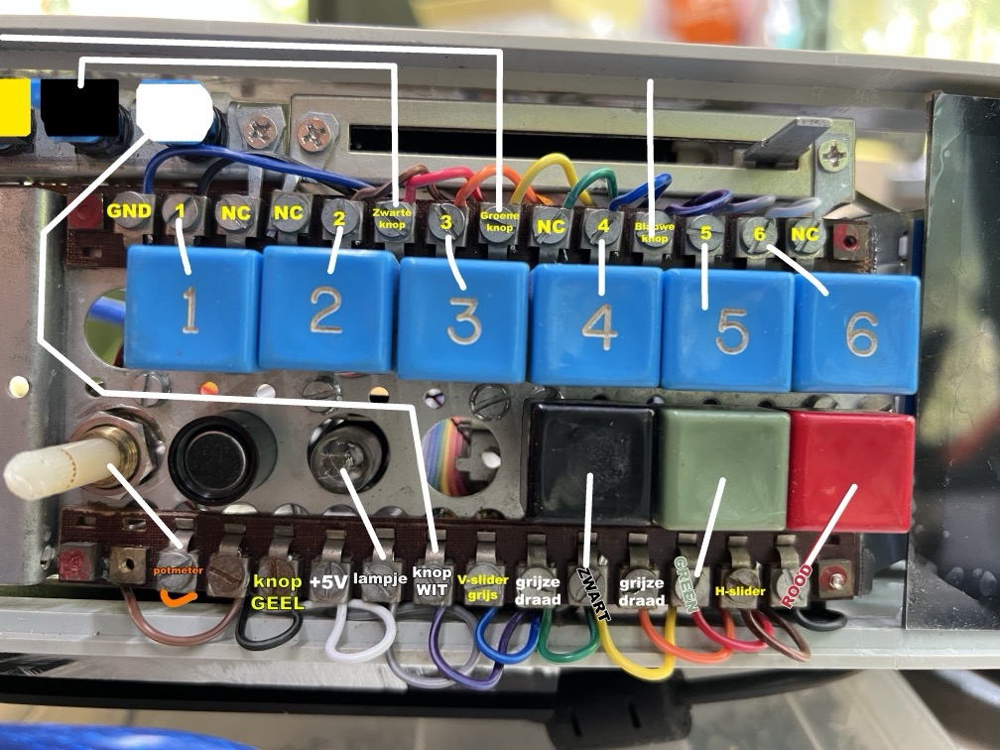

# Excel 97 Cyberdeck


The **Microsoft Excel 1997 Cyberdeck** is a one-of-a-kind project created by me Rick Companje for **Stichting SETUP** as part of their *Old Timer Tech* research initiative. This Cyberdeck combines retro hardware, innovative software, and cyberpunk aesthetics to deliver a fully functional, portable device for spreadsheet management without traditional input devices like a keyboard or mouse. It offers a fresh perspective on how we can creatively engage with old technology in new ways.

---

## Cyberdeck Overview

### Objectives
- **Reimagining old technology**: The Cyberdeck runs Microsoft Excel 1997 and enables users to input data, manage spreadsheets, and even create invoices using alternative input methods.
- **Local and secure operation**: The deck can function entirely offline, ensuring that all processing happens locally without any dependency on cloud services.
- **Aesthetic and functional**: Inspired by the cyberpunk ethos of the 1980s and office-core aesthetics of the 1990s, the device is rugged yet visually intriguing.

### Key Features
- **Alternative input**: The Cyberdeck features 18 buttons, 2 rotary encoders, 2 sliders, and 1 potentiometer.
  - **Rotary encoders**: Adjust numeric values in cells or switch between pre-selected cells.
  - **Sliders**: Scroll horizontally and vertically between spreadsheet fields.
  - **Buttons**: Includes an online/offline switch for the LLM (Large Language Model) functionality and a dedicated print button.
- **Audio**: Audio cues, including synthesized and sampled retro sounds, guide users through tasks.
  - Examples include spoken feedback for online/offline switching or saving an invoice.
- **Visual output**:
  - A **1440x1440** square touchscreen for navigation and display.
  - A **720x720** display embedded in a vintage Halina Diaviewer, magnified and distorted through a lens.

---


## Internet Kill Switch

### Offline Mode
When offline, the Cyberdeck utilizes a local instance of OpenAI Whisper for speech-to-text transcription. You can dictate simple commands such as:

- "Enter 100 in cell A1."
- "Clear the contents of column B."

### Online Mode
In online mode, activated by the red LLM button, the Cyberdeck connects to OpenAI's ChatGPT 3.5 via API. This unlocks powerful natural language capabilities, allowing users to describe complex actions, such as:

- "Set the background of cells A5:F15 to yellow with a dashed border."
- "Generate a list of 15 random cities in the Netherlands in column E."

ChatGPT interprets these commands and generates JSON instructions for seamless execution in Excel.

---

## Technical Details

### Hardware
The Cyberdeck combines a **retro aluminum casing** from the 1970s, a vintage intercom front panel, and modern components. Key hardware features include:
- **Input**: Buttons, rotary encoders, sliders, and a microphone.
- **Output**: Dual displays and audio feedback for a tactile and engaging user experience.
- **Connections**: Arduino MEGA for sensor management and serial communication.

A detailed [materials list](doc/Excel%2097%20Cyberdeck%20materialen.pdf) is included in this repository for a complete breakdown of the hardware.



---

## Software Components
The Cyberdeck software integrates Arduino firmware, Python scripts, and VBA macros to bridge the gap between hardware and Microsoft Excel 1997.

### Arduino Firmware
The [Arduino Firmware](Arduino/Cyberdeck.ino) handles input from all sensors connected to the MEGA and sends the data over serial communication.

- Example: Reading input from buttons and sliders**
```cpp
for (int i = 0; i < nButtons; i++) {
  (*all_buttons[i]).pressed = !digitalRead((*all_buttons[i]).pin);
  Serial.print((*all_buttons[i]).pressed ? (*all_buttons[i]).name : '.');
}
Serial.print(" ");
Serial.print(analogRead(POT));
Serial.print(" ");
Serial.print(analogRead(H_SLIDER));
//...
```

- Sleep mode and talk lamp brightness control:

```cpp
if (btn_talk.pressed) {
  timeBtnTalk = millis();
}
sleep = millis() - timeBtnTalk > 2000;
int brightness = btn_talk.pressed ? 255 : sleep ? max(a, 150) : 0;
analogWrite(LAMP_TALK, brightness);
```

### Python Scripts
####  SerialReader.py
This script ([SerialReader.py](Python/SerialReader.py)) processes data from the Arduino and communicates with Excel via UDP sockets.

- Field navigation using the rotary encoder:

```python
field = fields[field_index]
data = {"action": "select", "range": field}
send_udp_message(json.dumps(data), "127.0.0.1", 9999)
```

-  Audio feedback for printing invoices:
```python
if 'P' in value:
    filename = datetime.now().strftime("%Y-%m-%d-%H.%M.%S")
    send_udp_message(json.dumps({"action": "saveCopyAndPrint", "value": filename + ".xls"}), "127.0.0.1", 9999)
    play("saved-to-usb")
```

#### Cyberdeck-cli.py
This script ([Cyberdeck-cli.py](Python/Cyberdeck-cli.py)) manages audio input and integrates Whisper and ChatGPT functionality.

- Offline transcription with local Whisper:

```python
result = model.transcribe("output.mp3")
text = result["text"].strip()
data = { "action": "setValue", "value": text }
send_udp_message(json.dumps(data), IP, 9999)
```

- Online transcription (online Whisper) and natural language commands (ChatGPT):
```python
transcription = client.audio.transcriptions.create(model="whisper-1", file=file)
text = transcription.text
response = client.chat.completions.create(
    model='gpt-3.5-turbo',
    messages=[
        {'role': 'system', 'content': 'You are an Excel assistant generating JSON commands...'},
        {'role': 'user', 'content': text}
    ],
    temperature=0,
    stream=True
)
```

### VBA scripts in Excel 97
The VBA code (see [cyberdeck.xls](Excel/cyberdeck.xls)) processes JSON commands from Python to execute actions within Excel.

- Execute basic actions:

```vba
If action = "setValue" Then
    rng.value = value
ElseIf action = "increaseValue" Then
    rng.value = rng.value + value
End If
```

- Cell formatting:
```vba
If action = "setBackground" Then
    rng.Interior.color = RGB(msg("obj.red"), msg("obj.green"), msg("obj.blue"))
End If
```


---

## Installation and Setup

### Requirements
**Hardware**: Arduino MEGA, sensors, buttons, and displays wired as per the documentation.
**Software**:
 - Arduino IDE: To upload the firmware.
 - Python 3.x: Install dependencies (pyserial, whisper, pyautogui, etc.).
 - Microsoft Excel: Add the VBA macros for processing commands.

### Step-by-Step Instructions
 1. Hardware Assembly:
     - Connect all components and verify wiring.
     - Use the provided materials list for reference.
 2. Upload Firmware:
     - Use the Arduino IDE to upload the firmware to the Arduino MEGA.
 3. Configure Software:
     - Install required Python packages using `pip install -r requirements.txt`.
     - Load the VBA macros into Excel. You might need to change security settings in your Registry to enable ActiveX components like Winsock. See [Various notes](#various-notes)
 4. Launch the Cyberdeck:
     - Start [SerialReader.py](Python/SerialReader.py) to process input from the Arduino.
     - Run [Cyberdeck-cli.py](Python/Cyberdeck-cli.py) for audio input and optional LLM processing.

---

## Licensing
- **Hardware and non-software components**: Licensed under CC BY-SA 4.0.
- **Software**: Distributed under the MIT License.

---

## Contributions
This project is open-source, and contributions are welcome! Feel free to submit pull requests, report issues, or share your ideas for improvement.

---

## Various notes
* [sound](Excel/audio) from the Speak & Spell toy.
* [sound](Excel/audio) produced with `say` command in MacOS.
```bash
say -v Zarvox "Welcome to the SETUP Utrecht  Microsoft Excel 97 CYBERDECK........[[rate 50]]enjoy your time[[rate 100]].......ha-ha-ha" -o welcome.aiff
```
* convert aiif to wav using ffmpeg while inreasing the volume
```bash
ffmpeg -i saved2.aiff -filter:a "volume=2.0" /Volumes/Cyberdeck/github-repo/Excel/audio/saved2.wav -y
```
* Clean Up the WinSxS Folder: ```Dism.exe /online /Cleanup-Image /StartComponentCleanup```	

* archive.org has ISO files of the original [Office 97](https://archive.org/details/microsoft-office-97-professional_202112) in case you discarded your original CD-ROM. You will still need your license key though.
* I tried many different systems and OS'es and emulators: MacOS, Windows 7, Ubuntu, Lubuntu, Raspberry Pi OS. Emulators: [Wine](https://www.winehq.org/), [QEMU](https://www.qemu.org/). Most platforms failed in one way or another. Ultimately I used Windows 10 in Windows XP Compatibility Mode running on an [Fanless Intel 7th Gen Core i5 Mini PC](doc/Fanless%20Intel%207th%20Gen%20Core%20i5%20Mini%20PC.pdf).
* I have been thinking about selecting and mixing colors with these playful buttons. The buttons made it into the Cyberdeck but not for colormixing.

* you will need to enter the Winsock Control 6.0 license key in REGEDIT
```
HKEY_CLASSES_ROOT\Licenses\2c49f800-c2dd-11cf-9ad6-0080c7e7b78d = mlrljgrlhltlngjlthrligklpkrhllglqlrk
```
* you need to register the MSWinsck.OCX component:
```
Regsvr32.exe C:\Windows\SYSWOW64\MSwinsck.ocx
```
* You need to turn off the 'killbit' in the Windows Registry for Winsock. Make sure the following key is not set to value 0x400. I think it should be 0 to work.
```
{248DD896-BB45-11CF-9ABC-0080C7E7B78D}
```
* I think you also need `MSCOMM32.OCX`. Put 32-bit OCXs go into the `/Windows/SysWOW64` folder. Put 64-bit OCXs into the `/Windows/System32` folder. Followed by `regsvr32 mscomm32.ocx`. License for this OCX is:
```
[HKEY_CLASSES_ROOT\Licenses\4250E830-6AC2-11cf-8ADB-00AA00C00905]
@="kjljvjjjoquqmjjjvpqqkqmqykypoqjquoun"
```
* there is also a Joystick port! In the end we didn't use it. But it can still be accessed:
```cpp
const int pins[] = { 2, 3, 4, 5, 6 };
const char onDown[] = { 'a', 'b', 'c', 'd', 'e' };
const char onUp[] = { 'A', 'B', 'C', 'D', 'E' };
bool buttonState[sizeof(pins) / sizeof(pins[0])] = {0};

void setup() {
  Serial.begin(9600);
  for (int i = 0; i < sizeof(pins) / sizeof(pins[0]); i++) {
    pinMode(pins[i], INPUT_PULLUP);
  }
}

void loop() {
  for (int i = 0; i < sizeof(pins) / sizeof(pins[0]); i++) {
    bool currentState = digitalRead(pins[i]) == LOW;
    if (currentState != buttonState[i]) {
      buttonState[i] = currentState;
      if (currentState) {
        Serial.write(onDown[i]);
      } else {
        Serial.write(onUp[i]);
      }
    }
  }
  delay(16);
}
```
* [Here](https://learn.microsoft.com/en-us/previous-versions/office/developer/office-2003/aa210131(v=office.11)#example) is info about the Microsoft Clippy annimations you can trigger in Excel. Clippy didn't make it into final version of the Cyberdeck.
```vba
With Assistant
    .On = True
    .Visible = True
    .Move xLeft:= 400, yTop:= 300
    .MoveWhenInTheWay = True
    .TipOfDay = True
    .Animation = msoAnimationGreeting
End With
```


* I'm using a really nice python library ([ijson](https://pypi.org/project/ijson/) for parsing JSON that is streamed by ChatGPT. The library checks if new finished JSON objects have arrived:
```python
events = ijson.sendable_list()
coro = ijson.items_coro(events, "items.item")
seen_events = set()

for chunk in response:
    msg = chunk.choices[0].delta.content

    if msg:
        coro.send(msg.encode("utf-8"))
    
    if events:
        unseen_events = [e for e in events if json.dumps(e) not in seen_events]
        if unseen_events:
            for event in unseen_events:
                seen_events.add(json.dumps(event))
                print(json.dumps(event))
                send_udp_message(json.dumps(event), IP, 9999)
```
* to prevent the use of multiple 'threads' in python my [SerialReader](Python/SerialReader.py) script writes a file to disk called `is_recording.tmp` and removes it when the push-to-talk button is released. The other script ([cyberdeck-cli.py](Python/cyberdeck-cli.py)) checks the existence of this file and processes it when finished.

* Advanced commands:
    - "zoek in kolom M naar een waarde die in A1 genoemd wordt. Geef vervolgens de waarde in de cell er rechts naast (in kolom N)  terug en stop het resultaat in E1" (this is not possible since there's no way yet to send the value in A1 to the LLM)
    - "set numberformat voor d2:d5 naar currency met  twee cijfers achter de comma en met duizendtal seperator"
    - "set numberformat voor d2:d5 naar currency zonder valuta symbool, twee cijfers achter de comma en met duizendtal seperator"

* if you want to run a script but preserve the env variables (containing your API key for example):
```bash
sudo --preserve-env ./cyberdeck-cli.py
```
* Cyberdeck Cafe community op Discord - https://cyberdeck.cafe/

# Starting points (Dutch)
- computer hardware raakt snel verouderd omdat de software steeds zwaarder en ingewikkelder word maar niet perse nuttiger of makkelijker. Daarnaast zijn we steeds afhankelijker van internet en clouddiensten.
- Oude computers zijn vaak nog heel goed te hergebruiken wanneer je ze ombouwt naar een 'single purpose device': Een comptuter die maar één ding kan, maar daar wel heel goed in is.
- Samen met SETUP in Utrecht (platform voor een technologie-kritische samenleving) ga ik onderzoeken of ik een CYBERDECK kan maken voor Excel 97. De versie van Excel die eigenlijk gewoon 'af' was...
- oude, goedkope, afgeschreven apparatuur opnieuw gebruiken / recyclen door deze om te bouwen tot een 'single purpose device', iets wat alleen maar goed is in 1 ding.
- software die steeds complexer wordt, meer functies krijgt maar van je eigenlijk zou kunnen zeggen dat het niet perse nuttiger of beter wordt. Alleen logger, zwaarder en ingewikkelder.
- Ik wil daarom kijken of ik een apparaat kan maken dat als enige doel heeft om zo fijn mogelijk en op zonder afhankelijkheden van internet de ultieme versie van Excel te gebruiken 
- "Het is een cyberdeck, een computer die maar 1 ding kan maar daar dan wel heel goed in is. Maar het is wel met een knipoog. Want met dit cyberdeck kun je een oude versie van Microsoft Excel gebruiken. En dan ook nog eens zonder toetsenbord en muis. Met allemaal draaiknoppen en andere gekke bediening. En met spraakbesturing. Je kunt dus echt praten tegen het apparaat en bijv zeggen dat je een factuur wilt opstellen of je administratie wilt doen. En dan gaat ie je helpen."

# Culture & History
* Microsoft Excel Introduction 1990 commercial: https://www.youtube.com/watch?v=kOO31qFmi9A


* predecessors of Excel 97
 

# Sketching with Dall-E for an Excel 97 Cyberdeck


# Parts from my own collection


# The Green Van - where it happened


# Various images


